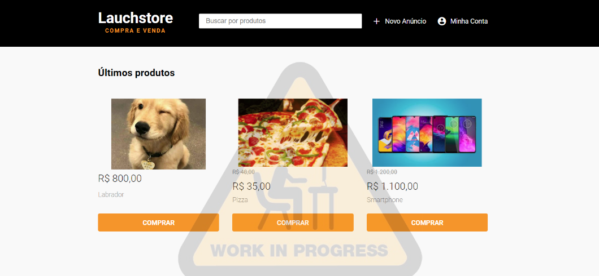

    

    

O projeto **LaunchStore** é um marketplace, servindo de intermediário entre cliente e vendedor, como Mercado Livre, Amazon, etc. Projeto criado no **Bootcamp LaunchBase**.

O PROJETO ESTA EM DESENVOLVIMENTO utilizando as seguintes tecnologias

- [Express](https://expressjs.com/pt-br/)
- [JavaScript](https://www.javascript.com/)
- [Nodejs](https://nodejs.org/en/)
- [NPM](https://www.npmjs.com/)
- [Nodemon](https://nodemon.io/)
- [Nunjucks](https://mozilla.github.io/nunjucks/)
- [PostgreSQL](https://www.postgresql.org/)

Outras bibliotecas usadas no desenvolvimento do projeto.

<blockquote>method-override, browser-sync, npm-run-alll</blockquote>

Desenvolvido por [Leonardo Oliveira](https://www.linkedin.com/in/leonardooliveiradias1/)
